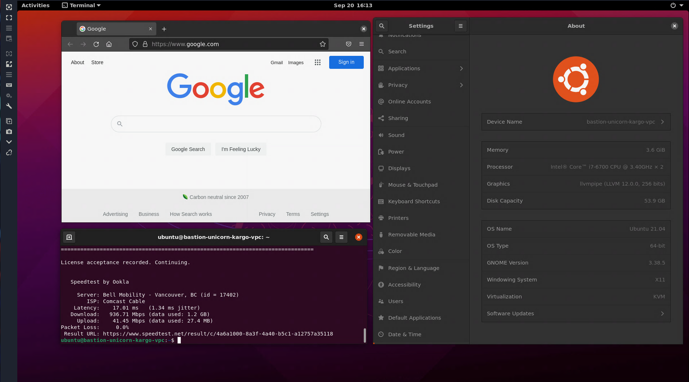
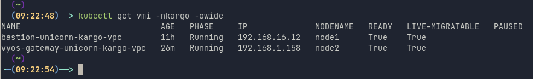

# CCIO Kargo Kubevirt VPC Helm Chart
Features:
  - Private NAT Network (vlan)
  - VyOS Firewall & Gateway
  - Ubuntu Bastion    
    - SSH    
    - RDP    



### How To:
  - Add CCIO Helm Chart Repo
```sh
helm repo add ccio https://containercraft.io/helm/
helm repo update
```
  - (optional) upload ssh key to secret
```sh
kubectl create secret generic user1-kargo-sshpubkey \
    --from-file=sshpubkey=$HOME/.ssh/id_rsa.pub \
    --namespace kargo --dry-run=client -oyaml \
  | kubectl apply -f -
```
  - Deploy vpc
```sh
helm install user1-kargo-vpc . --namespace kargo --values ./values.yaml
```
  - Connect to vm consoles
```sh
virtctl console -nkargo vyos-gateway-user1-kargo-vpc 
virtctl console -nkargo bastion-user1-kargo-vpc 
```
  - you can now ssh & rdp to bastion through gateway's public IP
```sh
kubectl get vmi -nkargo -owide
```

```sh
ssh ubuntu@192.168.1.158
```
