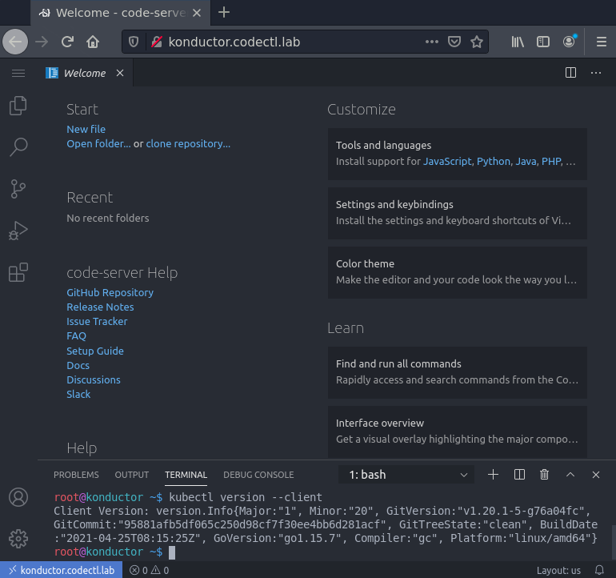

# Konductor Helm Chart


## Quickstart
    
1. Create Namespace
```sh
kubectl create namespace konductor
```

2. Add helm repo
```sh
helm repo add ccio https://containercraft.io/helm/
helm repo update
```

3. Deploy Konductor chart
```sh
helm install konductor --namespace konductor ccio/konductor 
```

4. Exec into Konductor
```sh
kubectl exec -n konductor -it $(kubectl get po -n konductor -ojsonpath='{.items[*].metadata.name}') -- connect
```

5. Review and setup Ingress 
```sh
kubectl get -n konductor svc
kubectl get -n konductor ingress
```

6. Access the Konductor container via SSH or VSCode in browser
